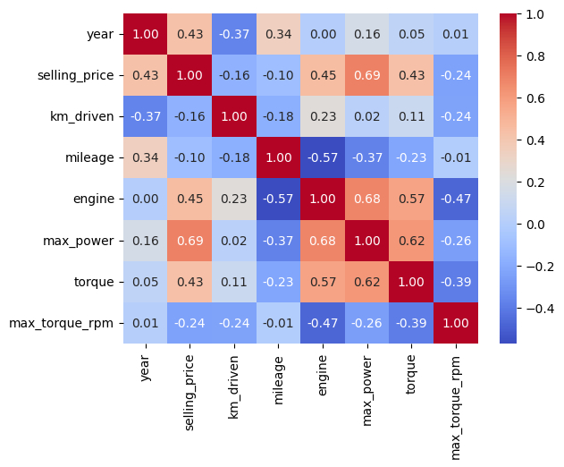

# Прогнозирование цены подержанных автомобилей

Проект по регрессии на табличных данных на основе работы по курсу «Методы машинного обучения», МИЭМ, 2026.

**Задача:** предсказать цену автомобиля `selling_price` по его характеристикам и сравнить модели классического машинного обучения.

**Лучший результат:** LightGBM с новыми признаками, R² = **0.977404** на test.

## Данные

Источник — [evgpat/datasets](https://github.com/evgpat/datasets). Снимок CSV включён в папку `data/`, поэтому исследование можно запустить без скачивания данных. Ноутбук использует локальные файлы; при их отсутствии загружает CSV из источника.

- Train: 6999 строк и 13 столбцов до обработки; 5840 строк после удаления повторов по признакам.
- Test: 1000 строк и 13 столбцов.
- Цель — цена `selling_price` в единицах исходного датасета.
- Признаки: название автомобиля, год, пробег, топливо, продавец, коробка передач, категория владельца, экономичность, объём двигателя, мощность, крутящий момент и число мест.

## Подход

1. Анализ распределений, пропусков, дубликатов и корреляций.
2. Удаление повторов в train, извлечение числовых характеристик, заполнение пропусков медианами train.
3. Приведение крутящего момента к Nm: `kgm × 9.80665`.
4. Линейная регрессия, стандартизация и регуляризация.
5. Выделение марки автомобиля и one-hot кодирование категорий.
6. Логарифмирование цены, Random Forest и LightGBM.
7. Сравнение LightGBM с отношением мощности к объёму двигателя и квадратом года выпуска и без этих признаков.

## Результаты

| Модель | R² train | R² test | RMSE test |
|---|---:|---:|---:|
| Линейная регрессия, числовые признаки | 0.600089 | 0.597245 | 481,160 |
| Линейная регрессия, стандартизация | 0.600089 | 0.597245 | 481,160 |
| Lasso, числовые признаки | 0.600089 | 0.597244 | 481,161 |
| Lasso + OHE | 0.774605 | 0.785293 | 351,311 |
| Ridge + OHE | 0.774590 | 0.785503 | 351,139 |
| ElasticNet + OHE | 0.735516 | 0.741353 | 385,587 |
| Линейная регрессия, log(цена) | 0.894375 | 0.914939 | 221,123 |
| Random Forest, log(цена) | 0.983692 | 0.966984 | 137,764 |
| LightGBM без новых признаков | 0.993718 | 0.976871 | 115,305 |
| LightGBM с новыми признаками | 0.994397 | 0.977404 | 113,969 |

RMSE рассчитана как √MSE в единицах цены. Полные значения находятся в [metrics.csv](reports/metrics.csv). Все модели обучены с обработкой `torque` в Nm.

При одинаковых параметрах LightGBM R² на test составляет 0.976871 без новых признаков и 0.977404 с ними. Разница: +0.000533.



## Структура проекта

- [notebooks/car_price_prediction.ipynb](notebooks/car_price_prediction.ipynb) — исследование, код, графики и результаты.
- `data/` — исходные train и test.
- `reports/metrics.csv` — таблица метрик.
- `reports/figures/` — график для README.
- `requirements.txt` — библиотеки анализа с зафиксированными версиями.
- `requirements-dev.txt` — Jupyter и инструменты запуска.

## Запуск

Используется Python 3.12. На macOS установите OpenMP для LightGBM через Homebrew ([официальная инструкция](https://github.com/lightgbm-org/LightGBM/blob/main/python-package/README.rst)):

```bash
brew install libomp
```

Из папки проекта создайте окружение:

```bash
python -m venv .venv
```

Активация на macOS/Linux:

```bash
source .venv/bin/activate
```

На Windows PowerShell:

```powershell
.venv\Scripts\Activate.ps1
```

Установите зависимости и запустите JupyterLab:

```bash
python -m pip install -r requirements-dev.txt
python -m jupyter lab
```

Откройте `notebooks/car_price_prediction.ipynb` и выполните Restart Kernel and Run All Cells. Сохранённые результаты можно посмотреть сразу, без выполнения.

Выполнение с сохранением в отдельный файл:

```bash
python -m jupyter nbconvert --to notebook --execute notebooks/car_price_prediction.ipynb --output car_price_prediction_executed --output-dir reports --ExecutePreprocessor.timeout=1800
```

Установка зависимостей и выполнение всех ячеек проверены в отдельном окружении Python 3.12.
